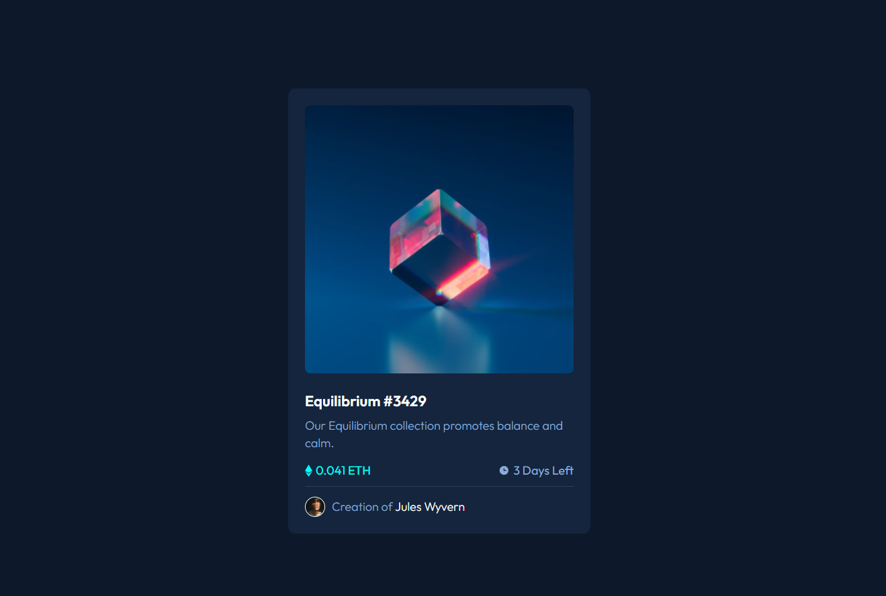

# Frontend Mentor - NFT preview card component solution

This is a solution to the [NFT preview card component challenge on Frontend Mentor](https://www.frontendmentor.io/challenges/nft-preview-card-component-SbdUL_w0U). Frontend Mentor challenges help you improve your coding skills by building realistic projects. 

## Table of contents

- [Frontend Mentor - NFT preview card component solution](#frontend-mentor---nft-preview-card-component-solution)
  - [Table of contents](#table-of-contents)
  - [Overview](#overview)
    - [The challenge](#the-challenge)
    - [Screenshot](#screenshot)
    - [Links](#links)
  - [Author](#author)

## Overview

### The challenge

Users should be able to:

- View the optimal layout depending on their device's screen size
- See hover states for interactive elements

### Screenshot

### Links

- Solution URL: [Github Repository](https://github.com/HakimRaissi/nft-card-component)
- Live Site URL: [Live Demo](https://hakimraissi.github.io/nft-card-component/)

## Author

- Frontend Mentor - [@HakimRaissi](https://www.frontendmentor.io/profile/HakimRaissi)
- Twitter - [@Hakim_Raissi_10](https://twitter.com/Hakim_Raissi_10)
